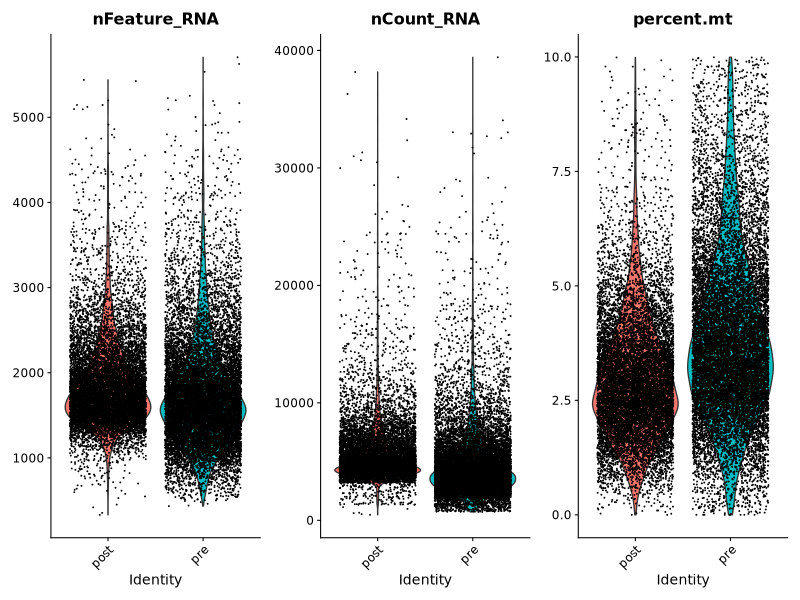
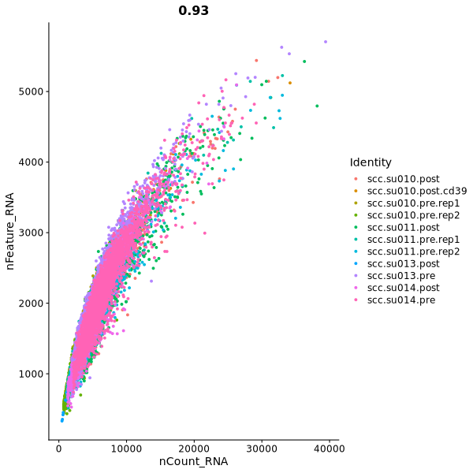
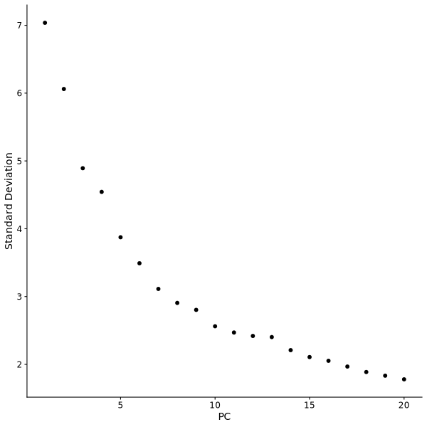
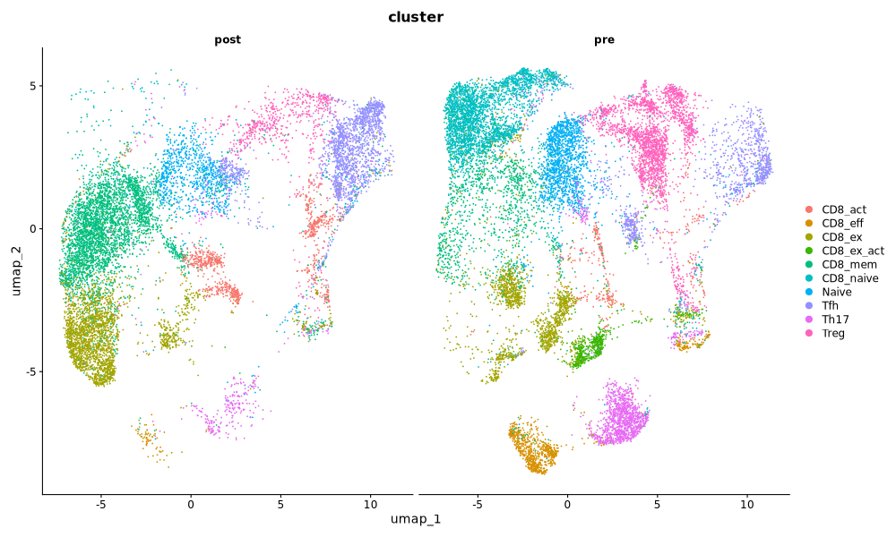
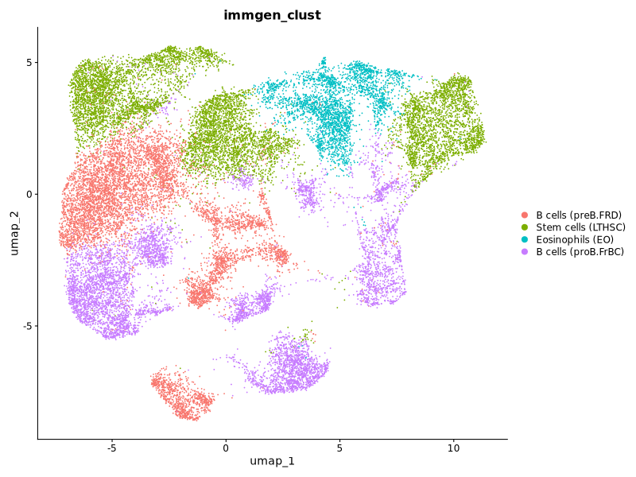
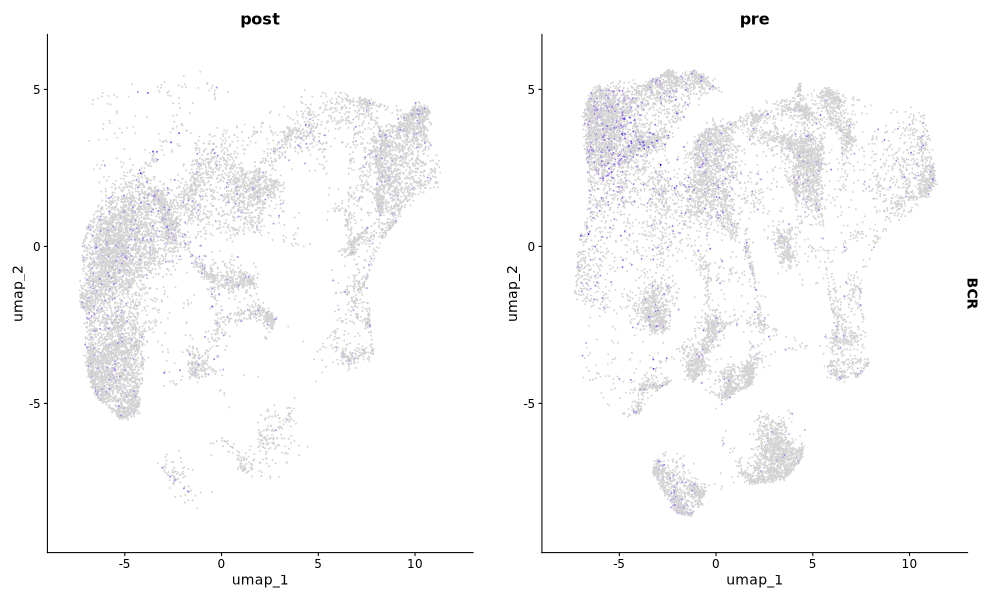

# scRNA-seq Analysis of Squamous Cell Carcinoma (GSE123813)

## 1. Project Overview
This project is a scRNA-seq pipeline to analyse Squamous cell carcinoma (scc) samples, pre- and post-anti-PD-1 therapy. The data is obtained from GEO: [GSE123813](https://www.ncbi.nlm.nih.gov/geo/query/acc.cgi?acc=GSE123813), which has already been processed through Cell Ranger to generate the count matrix. The entire pipeline can be reproduced using Conda and Snakemake.

## 2. Pipeline Structure
The analysis is automated using Snakemake, divided into four modular steps:

  - 01_get_data.R: Downloads raw counts and metadata from GEO and creates a Seurat object.

  - 02_qc_and_preprocess.R: Performs quality control (gene count, molecular count and mitochondrial contamination) and data normalization.

  - 03_clustering_umap.R: Dimensionality reduction (PCA/UMAP) and cluster annotation.

  - 04_annotation_and_dea.R: Cluster characterization and Differential Expression Analysis (DEA).

## 3. Analysis and Results
### Quality Control (QC)
We identify low-quality cells by looking at the number of detected unique genes (nFeature_RNA), unique molecular identifiers (nCount_RNA), and the percentage of mitochondrial genes (percent.mt). High mitochondrial content often indicates dying or stressed cells.
gene vs count correlation

The violin plots are divided by treatment. [Plots comparing type of cells](results/plots/qc_plots.pdf) are also available. This dataset has already been filtered, cells with fewer than 200 detected genes or more than 10% mitochondrial RNA were excluded.

This plot compares the number of unique molecular identifiers (UMIs) (nCount_RNA) with the number of unique genes per cell (nFeature_RNA). An r value of 0.93 indicates that the majority of RNA molecules were bound to a UMI. Therefore, we can assume that there are no significant technical artefacts.

### Preprocessing
The data is normalized using LogNormalize to account for sequencing depth differences. We then identify the top 2000 highly variable features for Principal Component Analysis (PCA). Next, we apply linear transformation. Finally we perform the PCA and use an Elbow Plot to select the number of PCs (16 in this case) that capture the majority of the data's variance.

### Clustering
Cells are grouped into clusters based on their gene expression profiles using a Shared Nearest Neighbor (SNN) graph. We visualize these clusters in 2D space using Uniform Manifold Approximation and Projection (UMAP), splitting the view by treatment to observe how the cellular gene expresion distribution changes post-therapy.

### Cell Type Annotation
Using the ImmGen reference database and the SingleR package, we can label each cluster to a type of cell.

### Gene expression
We can see the expression of a gene across cells. This plot represent the B-cell receptor (_BCR_) as an example.

### Differential Expression Analysis (DEA)
We perform DEA to identify markers for specific clusters and genes that are significantly upregulated or downregulated following treatment.

- [Cluster Markers](results/tables/cluster_markers.csv)
- [Treatment Markers (Post vs. Pre)](results/tables/treatment_dea.csv)

Specific markers like _BCR_ and _IGKC_ are visualized to show expression patterns across treatment conditions.

## 4. How to Reproduce
1. Clone the repo on a UNIX system or wsl: git clone <repo_url>
2. Build the environment using conda/mamba: mamba env create -f environment.yml   
3. Run the pipeline using Snakemake: snakemake --cores 4
Snakemake will automatically download the data, run the 4 scripts in order and generate the plots and tables in /results/.
